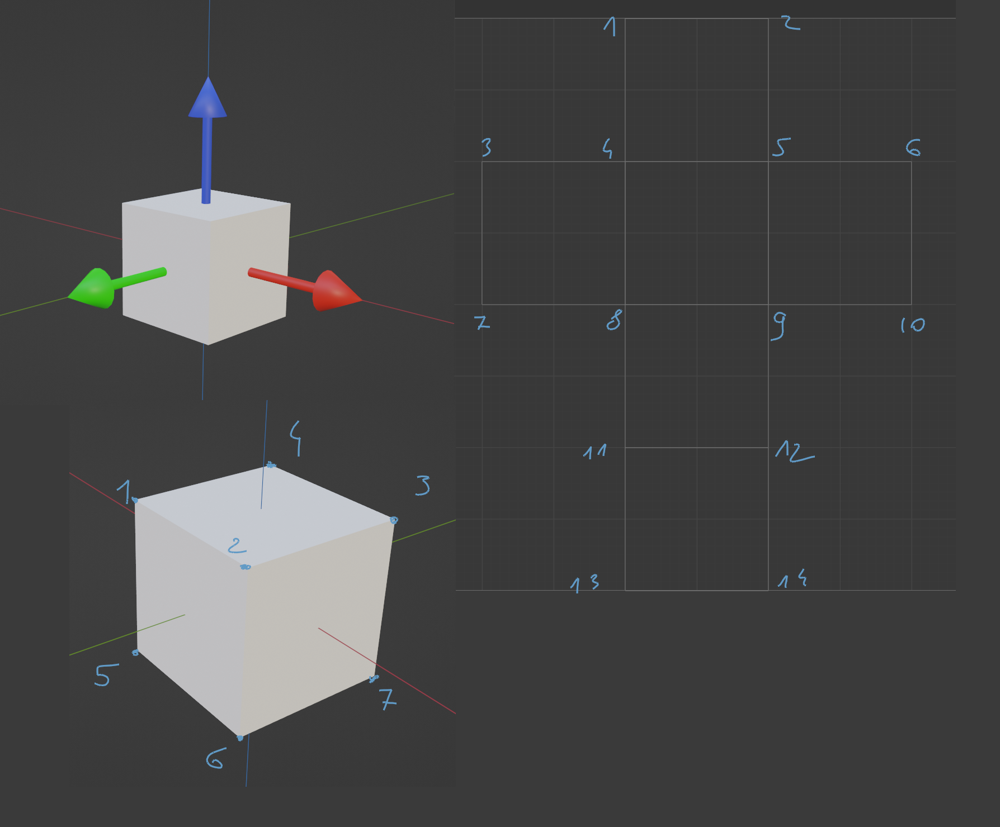

# Raytracer

# Rozbicie pliku z blendera 
  Tutaj wkleję sobie omówienie nagłówków w pliku obj tak dla lepszego zrozumienia co jest czym. Rozpiszę to na wszelki wypadek na bazie prostej kostki.
## Nagłówki w pliku i co opisują
- [x] f 1/1/1 2/2/1 4/3/1 3/4/1
  f to ostatni nagłówek w pliku ale opiszę nie po kolei bot to ważne dla lepszego zrozumienia co będzie później.
  Podzielone na potrójne grupy oddzielone ukośnikami. Każda grupa to jeden wierzchołek gdzie na pierwszym miejscu jest indeks wierzchołka, który tworzy ścianę.
  Na drugim odnośnik do indeksu tego samego wierzchołka na mapie UV. Na ttrzecim miejscu normalna przypisana do ŚCIANY nie wiem czemu w tej strukturze powtórzone dla każdego wierzchołka.

- [ ] v -1.000000 -1.000000 1.000000
    v to po prostu współrzędne wierzchołka x,y,z odwołąnie do indeksu w f w kolejności od góry zaczyna się od 1 nie od 0
    Na grafice poniżej lewy dolny róg
- [ ] vn -1.000000 -1.000000 1.000000
    vn to normalna ŚĆiANY zawsze tyle ile jest ścian indeksowanie analogiczne jak w v od góry i od 1
    Na grafice poniżej lewy górny
- [ ] vt -1.000000 -1.000000 
    vt rzutowanie tekstury na UV mapę zazwyczaj więcej punktów niż wierzchołków w przypaku kostki 14 indeksowanie analogiczne
    Na grafice poniżej prawa strona

## Grafika pomocnicza 

